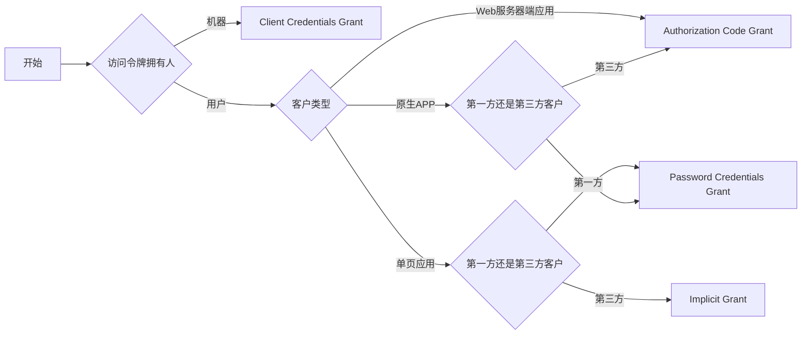

```mermaid
graph LR
    start[开始] --> owner{访问令牌拥有人}
    owner -- 机器 --> clientCredential[Client Credentials Grant]
    owner -- 用户 --> customerType{客户类型}
    customerType -- Web服务器端应用 --> authorizationCode[Authorization Code Grant]
    customerType -- 单页应用 --> customerSourceA{第一方还是第三方客户}
    customerType -- 原生APP --> customerSourceB{第一方还是第三方客户}
    customerSourceA -- 第一方 --> passwordCredential[Password Credentials Grant]
    customerSourceA -- 第三方 --> implicitCredential[Implicit Grant]
    customerSourceB -- 第一方 --> passwordCredential
    customerSourceB -- 第三方 --> authorizationCode
```